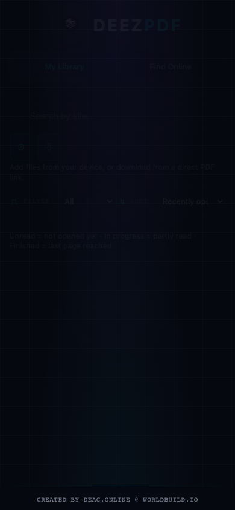

# DeezPDF Reader


Cyberpunk-styled PDF reader with a local library. Page-by-page like a Kindle, swipe navigation, automatic progress — PDFs stay on your device. Nothing is uploaded.


## Who it’s for

People who want a calm, offline-friendly PDF library without accounts or cloud upload. Import files, open a direct PDF URL, or look up public-domain titles online — reading position saves locally.

## Quick start

**Requires [Node.js](https://nodejs.org).** No terminal expertise needed.

| Platform | Steps |
|----------|--------|
| Windows | Double-click **`run.bat`** → wait for first-run install → app opens in the browser |
| macOS | Double-click **`run.command`** (first time: right-click → **Open**) → app opens in the browser |

Close the browser window when done — the launcher shuts down with it. Optional Windows standalone: `npm run build:exe`. Sticky local port: **5179**.

Install as a PWA from Chrome/Edge for an app-like window.

## Features

- Local library (IndexedDB) — Add PDF, Add Folder (Chrome/Edge), Download URL, Lookup
- Reader: swipe / arrow keys; progress restored on reopen
- Search / filter / sort in the library
- Optional iOS shell via Capacitor

## Screenshots

<details>
<summary>More screenshots</summary>

| Desktop | Phone |
|---------|-------|
|  |  |

</details>

## Privacy

- Library PDFs live on-device only
- **Lookup** sends search terms to Internet Archive, Project Gutenberg, and optionally a web search host; downloads come from those hosts when you add a result
- No accounts, tracking, or upload of your library

## Limitations

- Folder import needs Chrome or Edge (hidden on iOS Safari/WebKit)
- Only download PDFs you have the right to use
- See [docs/troubleshooting.md](docs/troubleshooting.md) for error codes and debug tips

## Development

```bash
npm install
npm run dev          # http://127.0.0.1:5179
npm run build
npm start            # launcher
```

PDF Lookup / Brave Search env notes stay under Development workflows in-repo (`BRAVE_SEARCH_API_KEY`, `VITE_PDF_SEARCH_URL`). iOS / App Store steps: [docs/ios.md](docs/ios.md). Platform matrix: [docs/platforms.md](docs/platforms.md).

## Credit

Created by [deac.online](https://deac.online) @ [worldbuild.io](https://worldbuild.io)

## License

MIT — see [LICENSE](LICENSE).
